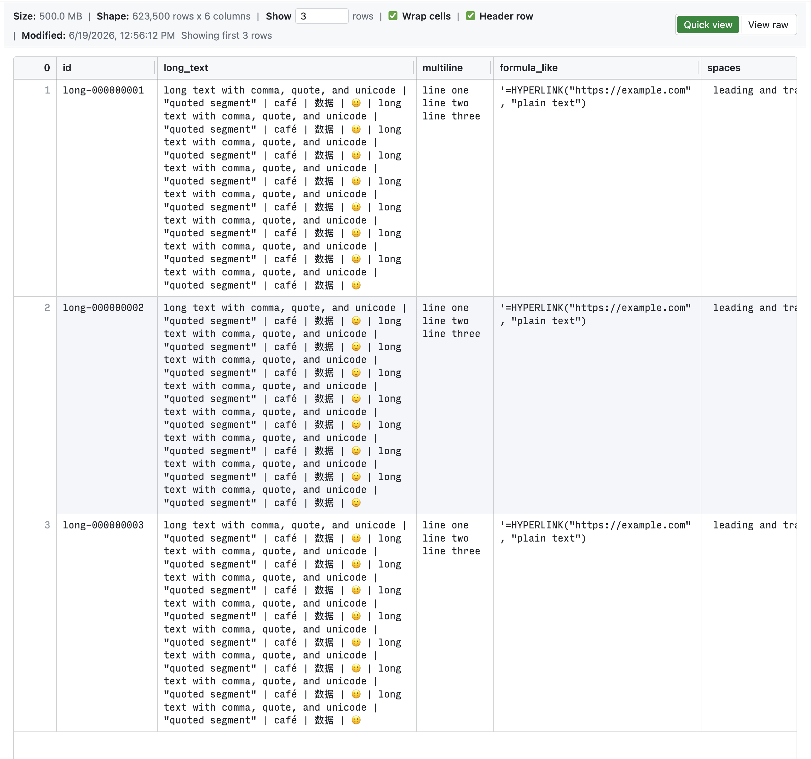

# Quick CSV Viewer

Quick CSV Viewer is a VS Code extension that opens `.csv` files in a readonly,
tabular custom editor designed to stay responsive with large comma-delimited
files.

You can also use it in IDEs that are based on VS Code (such as Cursor).

To install it, simply search its name "Quick CSV Viewer" in the "Extensions"
side panel of VS Code (or Cursor, etc.).

It is hosted both on VS Code marketplace and Open VSX:

- Visual Studio Marketplace:
  <https://marketplace.visualstudio.com/items?itemName=jsh9.quick-csv-viewer>
- Open VSX:
  <https://open-vsx.org/extension/jsh9/quick-csv-viewer>

## 1. Features

- **Very fast file loading**: render the top X rows instead of the whole file.
- **Readonly viewing**: prevent accidental changes to precious data files.
- **Intuitive UI**: toggle cell wrapping, adjust column widths, and inspect CSV
  files in a clean table view.

## 2. Screenshots



## 3. Usage

Open any `.csv` file in VS Code and Quick CSV Viewer opens it with the custom
viewer by default.

Git staged and unstaged CSV diffs stay in VS Code's native diff editor.

You can also run `Quick CSV Viewer: Open in Quick CSV Viewer` from the command
palette, the editor title menu, or the Explorer context menu for a `.csv` file.

Use `Ctrl+F` on Windows/Linux or `Cmd+F` on macOS to search text in the rendered
viewer contents. In indexed virtual views, Find searches the rows currently
rendered by the viewport plus the viewer's small overscan buffer; scroll to
search another range.

## 4. Settings

- `quickCsvViewer.maxRows`: number of data rows to show. Default is `20`.
- `quickCsvViewer.maxRows: 0`: index the full file and render visible rows on
  demand.
- The info bar `Show [input] rows` control updates `quickCsvViewer.maxRows`
  globally when you press Enter or leave the field.
- `quickCsvViewer.firstRowIsHeader`: treat the first CSV record as headers.
  Default is `true`.
- The info bar `Header row` control updates
  `quickCsvViewer.firstRowIsHeader` globally.
- `quickCsvViewer.wrapCellContents`: wrap table cell contents. Default is
  `true`.
- The info bar `Wrap cells` control updates
  `quickCsvViewer.wrapCellContents` globally.

## 5. Header Row And Row Index

When `quickCsvViewer.firstRowIsHeader` is enabled, Quick CSV Viewer renders the
first CSV record as the frozen table header and shows it with row index `0`.
Data rows start at row index `1`.

When `quickCsvViewer.firstRowIsHeader` is disabled, Quick CSV Viewer does not
freeze a top header row. The first CSV record is rendered as row index `1`.

The row-index column is always frozen on the left side of the table.

Columns size themselves from the CSV rows already loaded into the viewer. In
indexed mode, that means the visible row range plus the header fields. Drag a
column boundary in the header, or in the generated width-control row when header
mode is off, to resize a column until the viewer is closed or reloaded.

## 6. Indexed Mode

When `quickCsvViewer.maxRows` is `0` or a large positive preview count, Quick CSV
Viewer does not send the whole file to the webview. It builds a byte-offset
record index with progress, then the webview requests only the visible row range
while scrolling. This keeps DOM size bounded for very large files.

## 7. Raw Contents

`View raw` opens the file in VS Code's default text editor. The extension's top
info bar is not available there, but you can return to the viewer with
`Open in Quick CSV Viewer` from the editor title, Explorer context menu, or
command palette.

## 8. Notes for Developers

```sh
npm install
npm test
npm run format
```

`npm install` installs Husky hooks automatically. The pre-commit hook runs
`npm test`.
Prettier formats the project with an 80-column print width, and `npm test`
checks formatting before compiling and running the test suite.

Use VS Code's extension host launch flow to test the viewer manually with the
small and large files in `sample-data/`.

The `Run Extension` launch configuration opens generated files from
`sample-data/` through the internal `quickCsvViewer.openSampleFiles` command.
These `.csv` files are local-only test fixtures and are ignored by Git. Generate
two small fixtures and three 500 MB+ fixtures with:

```sh
python3 sample-data/generate_large_csv.py
```

For a faster smoke test, lower the target size of each large file:

```sh
QUICK_CSV_BIG_SIZE_MB=5 python3 sample-data/generate_large_csv.py
```
